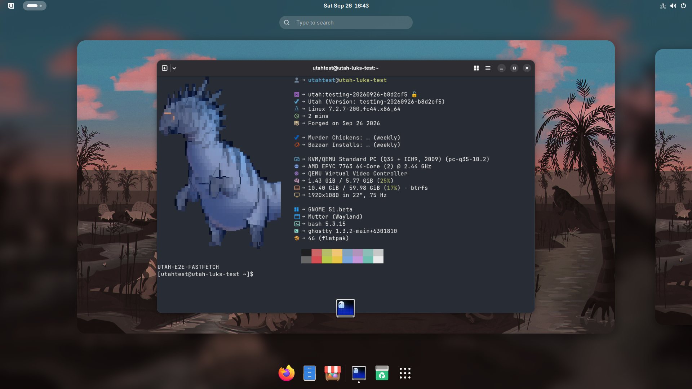

# Utahraptor

<!-- BEGIN E2E VERIFICATION -->

*LUKS ISO test passed for commit `dbd1425a17e1`. [CI run](https://github.com/projectbluefin/utah/actions/runs/35469913325); [screenshots and provenance](docs/verification/README.md).*
<!-- END E2E VERIFICATION -->

†Utahraptor ostrommaysi

Bluefin built on Fedora Hummingbird. The more ... civilized murder machine.

> Your day keeps getting worse. Why are there more.

**Experimental pre-alpha** — the image builds, boots, and installs end to
end in local QEMU validation: the live ISO's bootc-installer creates a
LUKS2-encrypted disk from the ISO's embedded container store with no
network, and the installed system boots on its own to GDM and a GNOME
session (verified record: [docs/verification](docs/verification/README.md)).
None of that is published — no image has been pushed to a registry and no
ISO has been released — but the installer and offline payload it exercises
are implemented, not a future milestone. Nothing here is ready to run on a
machine you care about. [Filing
issues](https://github.com/projectbluefin/utah/issues) is the whole point.

## What it is

[Bluefin](https://projectbluefin.io) built on [Fedora
Hummingbird](https://packages.redhat.com), which supplies a hardened, fast-moving
bootable base and no desktop at all. Utah adds the desktop: Bluefin's package
contract on top, and the GNOME 51 stack built from source because neither
Hummingbird nor a Fedora release ships it.

Two repositories, the way `common` and `brew` already work:

| Repository | What it does |
|---|---|
| [`projectbluefin/utah`](https://github.com/projectbluefin/utah) | This one. Composes the image. |
| [`projectbluefin/utah-packages`](https://github.com/projectbluefin/utah-packages) | Builds GNOME 51 and the rest of the desktop stack from verified upstream sources, and publishes them as an OCI image. |

## Image streams

| Tag | Stream | What it is |
| ---: | ---: | ---: |
| `:testing` | Dev | Built from `testing`, advanced only after end-to-end validation. |
| `:stable` | Stable | Promoted from `:testing`. |

Four flavors per stream — `utah`, `utah-nvidia`, `utah-gaming`,
`utah-nvidia-gaming` — matching Bluefin's. `config/flavors.json` is the single
source for that set, for the promote and release matrices, and for whether the
kernel cache image gets built at all.

**None of these are published yet.** The tags above describe what the pipeline
is built to produce, not something you can pull today.

## Package parity with Bluefin

`packages/bluefin.toml` is a byte-for-byte copy of Bluefin's `base.toml` at the
upstream revision pinned in `packages/.bluefin-parity-ref`, and CI diffs it
against that exact revision on every run, so local drift fails the build rather
than being noticed later.

| | count |
| --- | --- |
| Bluefin contract installed | **57** |
| Utah additions (GNOME 51, base-image parity, device firmware, desktop services) | 49 |
| Genuinely unavailable | **10** |

The install writes its resolved list to `/usr/share/utah/contract.txt` and the
verify step asserts *that file*, so the two cannot disagree. These counts are
generated from `packages/bluefin.toml` and `packages/utah.toml`
(`scripts/generate-site-data.py`, `site/data/packages.json`); `just check`
fails if this table drifts from that output (`scripts/check-doc-counts.py`).

## Known gaps

This is the honest list, and it is why the label above says pre-alpha.

- **Nothing is published.** No image has been pushed to a registry and no ISO
  artifact has been released. The live ISO and its bootc-installer payload
  are implemented and pass an offline, LUKS2-encrypted install end to end in
  local QEMU validation (`just iso`, `just luks-test`; record and screenshots
  in [docs/verification](docs/verification/README.md)) — what is missing is
  publication, not the installer.
- **Live media boot paths and Secure Boot.** Live media requires UEFI boot;
  legacy BIOS and file-backed/Ventoy booting are explicitly unsupported (flash
  directly using Fedora Media Writer or `dd`). As a documented exception
  (Issue #22), live media runs SELinux in Permissive mode (`enforcing=0`)
  because rootless container squashfs generation cannot preserve SELinux xattrs;
  installed target systems boot Enforcing normally. Because the live environment
  currently uses `systemd-boot-unsigned`, Secure Boot must be disabled in firmware
  to boot the live media until signed shim integration is complete. Custom OGC
  kernels and NVIDIA modules similarly require MOK enrollment or Secure Boot
  disabled.
- **Cross-vendor switch and update timers (`bootc-fetch-apply-updates`).**
  Switching to Utah from Bluefin or other bootc images carries Bluefin's
  `/etc/systemd/system/timers.target.wants/bootc-fetch-apply-updates.timer`
  symlink across ostree's 3-way `/etc` merge. Utah masks
  `bootc-fetch-apply-updates.timer` and `bootc-fetch-apply-updates.service` in
  both `/etc` and `/usr/lib/systemd/system/` (and presets them to disabled) so
  background auto-updates do not bypass `uupd` policy or silently undo a
  rollback (`bootc rollback`). Switchers should verify with
  `systemctl is-enabled bootc-fetch-apply-updates.timer` and can re-assert the
  mask (`systemctl mask --now bootc-fetch-apply-updates.timer bootc-fetch-apply-updates.service`)
  if a merged `/etc` wants symlink remains on disk (links #17, #101).
- **Wi-Fi needs a package the factory has not built yet.** The image ships no
  device firmware of its own — the bootable base carries none, and Bluefin only
  appears to because Fedora's Silverblue base supplies `linux-firmware`. `[hardware]`
  in `packages/utah.toml` now installs it, so a wireless driver can load its
  blob. That is necessary but not sufficient: Hummingbird's `NetworkManager-wifi`
  requires `wireless-regdb` and a supplicant, none of which exists in any
  enabled repository, so NetworkManager still does not manage the interface
  (`utah-packages#136`; the pin that would carry them is `#126`).
- **The NVIDIA and gaming flavors are unproven.** The OGC kernel compiles with
  `sched_ext` and `binderfs` genuinely enabled, and the NVIDIA open module
  compiles for the base kernel. The module against the OGC kernel, the driver
  installer flags, and the flavored builds pulling the kernel cache image have
  not yet all passed in one run.
- **Codec support differs.** Twelve `[multimedia_overrides]` names are packages
  Fedora already ships and Bluefin *replaces* with negativo17 builds. Utah
  installs Fedora's. Nothing is absent from the image; hardware-accelerated
  codecs are what differ. `utah-packages` already builds several of them, so
  this closes when Utah consumes that overlay.
- **The image is still pre-alpha.** The digest-pinned `utah-packages` OCI
  repository is consumed and the local QEMU image reaches GDM and GNOME Shell.
- **CUDA is deliberately excluded** — 7.68 GB installed. Use the NVIDIA
  container toolkit, which is included, and run CUDA in a container.

See the [open issues](https://github.com/projectbluefin/utah/issues) for where
things stand.

## Contributing or building from source

See [docs/building.md](docs/building.md) for how to build the image locally,
and [docs/skills/](docs/skills/) for the deep documentation. Agents start at
[AGENTS.md](AGENTS.md).
