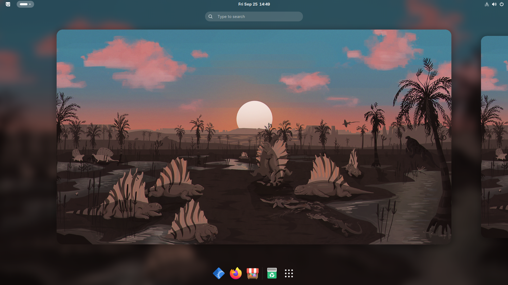
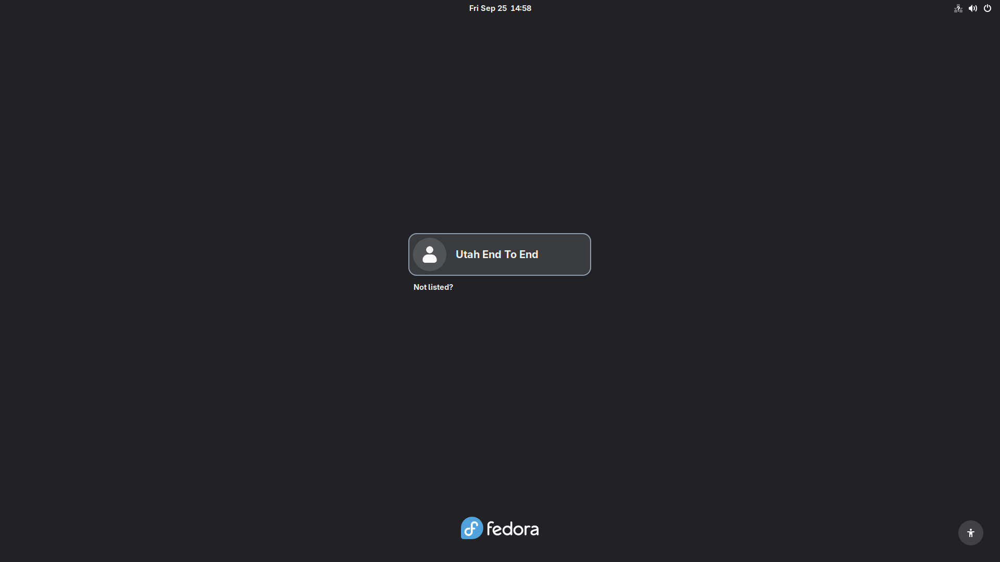
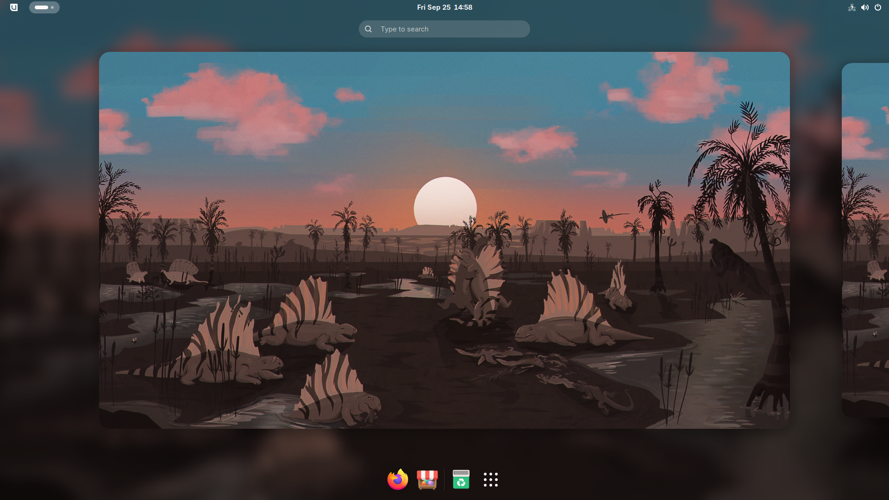

# Verification

Written by `just luks-test` (iso/scripts/luks-e2e.sh). Do not edit by hand:
the next passing run overwrites it.

Every image below is a QEMU screendump taken during that run, at the moment
the check beside it passed.

| | |
| --- | --- |
| Captured | 2026-09-25T14:59:12Z |
| Live ISO | `utah-live.iso`, 4.1G |
| Installed image | `ghcr.io/projectbluefin/utah@sha256:731cc0d2f2c69f531ef96ce2979da4005a63ee2b45f512570c3d1839a01d5de2` |
| Root filesystem | btrfs on LUKS2, passphrase unlock |
| Live session | GNOME, wayland |
| Installed session | GNOME, wayland, user `utahtest` |

## What passed

1. The live ISO boots and its session reaches `graphical.target` with
   `gdm.service` active and `gnome-shell` running — not a text console
   that merely answers SSH.
2. The installer creates a LUKS2 volume and installs from the ISO's embedded
   container store, with no network.
3. The installed disk boots on its own, with no ISO attached.
4. Plymouth's passphrase prompt is answered and the root volume opens.
5. The system reaches the graphical target rather than an emergency shell.
6. `bootc status` on the installed system reports the booted image as the
   offline embedded payload, not a substitute reached over a network this
   guest does not have.
7. The user logs in at the GDM greeter and gets a GNOME session.
8. Every default Flatpak in the Brewfile contract is present and listed by
   `flatpak` on the installed, network-isolated system.

## Screenshots

### The installed system, running

A terminal on the desktop this test built, reporting the OS, kernel and
desktop from inside it. Everything below is how it got there.

### Live session

The desktop the ISO boots into, with the installer available.

### GDM greeter on the installed system

After the encrypted root has been unlocked and the system has reached the
graphical target. This is what proves the boot did not stop at a console.

### Logged in

`utahtest`'s GNOME session, entered by typing the password at the
greeter above.

